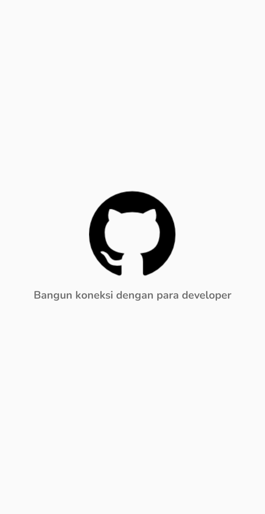
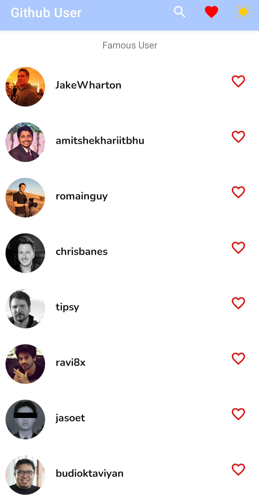
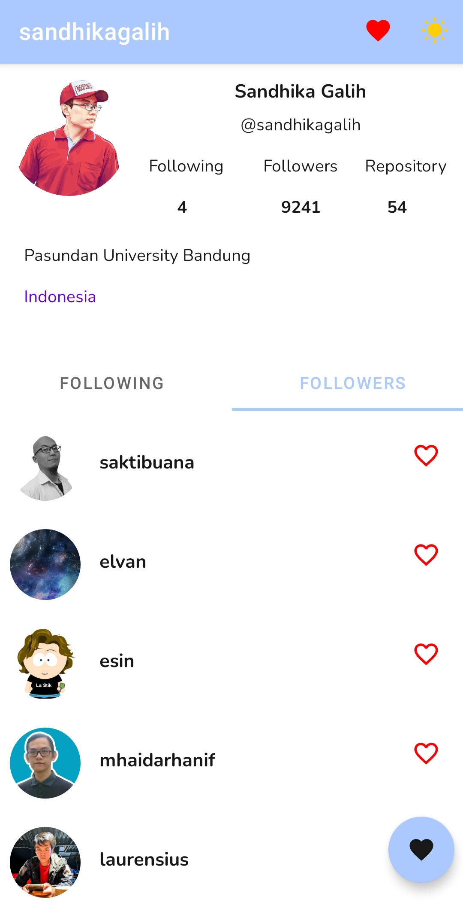

# Github-Users
Dicoding Submission ke - 3 . Membuat aplikasi Github User menggunakan Android Studio dengan bahasa pemrograman Kotlin. Menggunakan Live Data dengan API.

Pada Submission ini saya belajar tentang :
**Retrofit**
**View Model & Live Data**
**Unit Testing**
**Application Program Interface (API)**
**Data Store**

 
 

